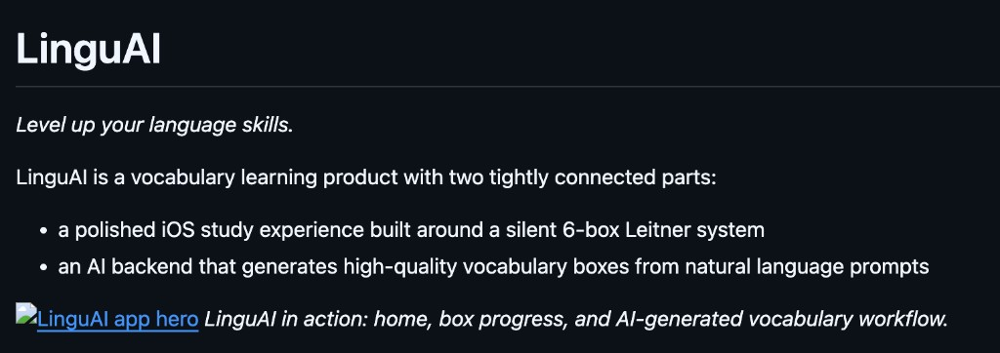

# LinguAI

*Level up your language skills.*

LinguAI is a vocabulary learning product with two tightly connected parts:
- a polished iOS study experience built around a silent 6-box Leitner system
- an AI backend that generates high-quality vocabulary boxes from natural language prompts


*LinguAI in action: home, box progress, and AI-generated vocabulary workflow.*

## 🚀 Overview

LinguAI is designed for learners who want real progress without notification stress.

- **What it does:** helps users learn and retain vocabulary through spaced repetition and topic-based study boxes
- **Who it is for:** language learners who prefer short, focused daily practice over gamified pressure
- **Why it is interesting:** it combines product UX thinking (frictionless study loop) with backend AI orchestration (reliable agent pipeline with idempotent mobile retries)

This repository is intentionally full-stack:
- **Frontend (FE):** SwiftUI + SwiftData iOS app in `LinguAI/`
- **Backend (BE):** FastAPI + LangGraph AI system in `main.py` and `app/`

## 📱 iOS App (Frontend)

The iOS app is built to make learning feel calm, not chaotic.

### User experience
- Users create vocabulary boxes by topic (for example: travel, restaurant, daily conversation)
- Each word moves through a **6-box Leitner progression** based on correct/incorrect answers
- Spaced repetition is automatic and mostly invisible to the user
- Study sessions prioritize due words first, then backfill with near-future words for continuity

### Key frontend features
- **Vocabulary boxes:** create, edit, and manage topic collections
- **Card-based study flow:** reveal answer, self-grade, continue
- **Progress visualization:** box distribution and completion percentages
- **Configurable study settings:** session size, study direction, haptics
- **Translation-assisted entry:** faster creation of bilingual word pairs

### FE ↔ BE interaction
- The app calls `POST /generate-boxes` for AI-assisted box generation
- Payload includes prompt, target language, and user context from existing boxes
- Response returns a structured box candidate (or a recoverable status with user-safe messaging)

## 🤖 AI Agents System (Backend)

This is the core technical differentiator of LinguAI.

### Problem the agent system solves

Generating vocabulary is easy. Generating *useful* vocabulary is hard.

The backend must produce output that is:
- relevant to the learner prompt
- appropriate to learner level
- aligned with target language constraints
- non-duplicative with known words
- robust to mobile retries and partial failures

### Why agents instead of a single LLM call

A single prompt can generate words, but it cannot reliably enforce product constraints at scale.  
LinguAI uses a staged workflow where each node has a narrow responsibility and measurable outcome.

### Agent roles and responsibilities

The LangGraph workflow in `app/graph.py` orchestrates specialized nodes from `app/box_workflow.py` and related modules:

- **Request understanding agent:** extracts intent and early relevance signals from user prompt
- **Relevance gate:** blocks off-topic requests with explicit, user-readable status
- **Topic identification agent:** deterministic-first classification with AI fallback
- **Level resolution agent:** resolves CEFR level from explicit cues or inference
- **Retrieval agent:** queries local SQLite vocabulary store first
- **Quality assessor:** decides if DB results are strong enough or if generation is required
- **AI word generation agent:** calls OpenAI Responses API with strict JSON schema
- **Merge/filter agent:** deduplicates and blends DB + AI candidates with deterministic tie-breaking
- **Finalize agent:** builds final box payload and response metadata
- **Persistence agent (async):** stores AI fallback pairs post-response via `BackgroundTasks`

### Orchestration and decision logic

The workflow is intentionally hybrid:
- **Deterministic when possible:** topic keywords, routing logic, dedupe, response assembly
- **Probabilistic when useful:** intent parsing, fallback topic inference, constrained word generation
- **Branch-aware:** skips generation when retrieval quality is already high

This design improves:
- latency (fewer unnecessary model calls)
- cost efficiency (DB-first strategy)
- consistency (schema-constrained output)
- safety (structured statuses instead of brittle free text)

### Reliability design choices (case-study highlights)

- **Idempotency for mobile retries:** `(customerId, requestId)` + payload hash
  - same request replay returns cached success response
  - same ID with different payload returns `409 Conflict`
- **Async persistence:** user gets a fast response; AI fallback storage runs in background
- **Debug observability:** when `DEBUG=true`, the backend exposes graph introspection endpoints:
  - `GET /debug/graph/ascii`
  - `GET /debug/graph/render`
- **Privacy-aware logging:** non-debug mode focuses on metadata and workflow outcomes

## 🧠 How It Works (System Overview)

This is the end-to-end product loop from interaction to learning outcome:

1. User opens the iOS app and requests vocabulary for a specific scenario
2. Frontend sends prompt + context (known words and box progress) to `POST /generate-boxes`
3. Backend workflow decides retrieval path, optionally generates AI candidates, and returns structured output
4. App presents the generated box directly in the study experience
5. Learner studies using the Leitner loop, creating fresh context for future requests

## 📸 Visuals

- **Product hero:** overall brand, app direction, and multi-screen UX

> Tip: move screenshots into a repository folder such as `docs/images/` for portable GitHub rendering.

## 🛠 Tech Stack

### Frontend (iOS)
- SwiftUI
- SwiftData
- Apple Translation framework
- Swift Testing (`LinguAITests`)

### Backend (AI system)
- Python
- FastAPI + Uvicorn
- LangGraph + LangChain
- OpenAI Responses API + `langchain-openai`
- SQLite for vocabulary and idempotency persistence

## ⚙️ Getting Started

### 1) Clone and set up backend

```bash
git clone <your-repo-url>
cd LinguAI
python3 -m venv .venv
source .venv/bin/activate
pip install -r requirements.txt
cp .env.example .env
```

Update `.env`:
- set `OPENAI_API_KEY`
- optionally tune `OPENAI_MODEL`, `OPENAI_WORD_GEN_MODEL`, `DEBUG`

Run backend:

```bash
uvicorn main:app --reload --host 0.0.0.0 --port 2024
```

Quick checks:
- Health: `GET http://localhost:2024/`
- Main endpoint: `POST http://localhost:2024/generate-boxes`

Example request:

```bash
curl -s -X POST http://localhost:2024/generate-boxes \
  -H "Content-Type: application/json" \
  -d '{
    "requestId": "req-001",
    "customerId": "cust-1",
    "prompt": "A1 restaurant words in German",
    "defaultLanguage": "en",
    "targetLanguage": "de",
    "existingBoxes": []
  }'
```

### 2) Run the iOS app

1. Open `LinguAI.xcodeproj` in Xcode
2. Run on simulator or physical device
3. If using a physical device, configure `LINGUAI_API_BASE_URL` to your machine IP (for example `http://192.168.1.5:2024`)

### 3) Run tests

- **iOS tests:** run `⌘U` in Xcode (`LinguAITests`)
- **Backend tests:**
  ```bash
  pytest
  ```

## 📂 Project Structure

```text
LinguAI/
├── LinguAI/                  # SwiftUI app, models, views, app flows
├── LinguAITests/             # Swift Testing suites
├── Specifications/           # Given/When/Then behavior specs
├── app/                      # LangGraph nodes, prompts, schemas, stores
├── main.py                   # FastAPI app and /generate-boxes endpoint
├── scripts/                  # Data ingestion and evaluation scripts
├── tests/                    # Backend tests (pytest)
├── data/                     # Local runtime DB files
└── docs/                     # Architecture and implementation notes
```

## 🤝 Contributing

Contributions are welcome, especially in:
- language coverage expansion
- evaluation quality and benchmarking
- iOS learning UX improvements
- agent reliability and observability

To contribute:
1. Fork the repo
2. Create a feature branch
3. Add tests for behavior changes
4. Open a pull request with a clear problem/solution summary

## 📄 License

This repository currently has no published license file.  
If you plan to reuse or distribute it, open an issue first to align on licensing.
